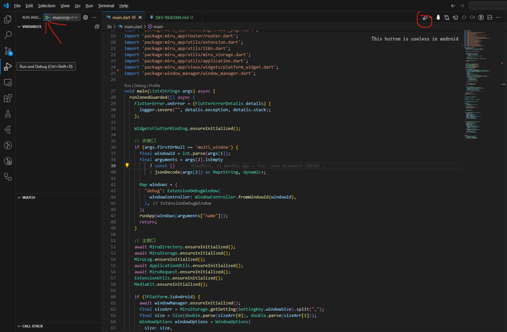

When build android, please add --flavor [dev|prod] to make flutter happy.
Example:
    flutter run --flavor dev

You should use vscode and run the code in "Running and Debug" pannel (when developing in android).

